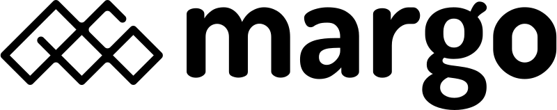

  

The margo initiative defines mechanisms for interoperation between edge applications, devices, and orchestration software through ― amongst others ― an open standard at home in this repository.

Find out more about the Margo initiative here [https://www.margo.org/](https://www.margo.org/).

## Contributing

Contributions are encouraged and welcome! Contributors to the specification are required to sign the appropriate CLA. See [CONTRIBUTING.md](CONTRIBUTING.md) for details.

## Licenses

Margo contributors contributing to this draft specification have made those contributions subject to the Open Web Foundation Contributor License Agreement Contribution Copyright Grant, available at [Open Web Foundation - CLA Copyright Grant 0.9](https://www.openwebfoundation.org/the-agreements/the-owf-0-9-agreements-necessary-claims/cla-copyright-grant-0-9).

Copyright ©️ 2024 Margo.
