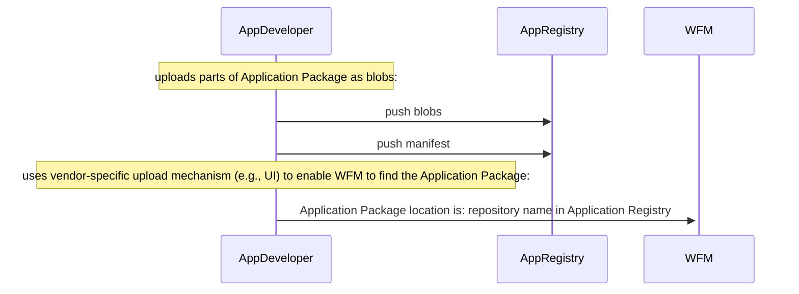
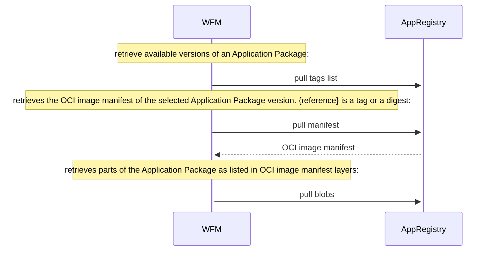

# Application Registry

The interactions of an `Application Registry` are described [here](../../concepts/applications/application-registry.md) from a conceptual view. This section formally specifies the API of the `Application Registry` and the exchange of an [Application Package](../../concepts/applications/application-package.md), defined through an [Application Description](../../specification/applications/application-description.md) file, from an Application Developer to the [Workload Fleet Manager](../../personas-and-definitions/technical-lexicon.md#workload-fleet-manager) (WFM). The `Application Registry` is designed as an `OCI Registry`, i.e., it offers an API compliant with the [OCI Distribution Specification](https://github.com/opencontainers/distribution-spec/blob/v1.1.0/spec.md) (called here the "OCI_spec") for digital artifact distribution. This way, the Application Registry hosts the parts of an [Application Package](../../concepts/applications/application-package.md) in the form of `blobs` and uses `image manifests` according to [OCI Image specification](https://github.com/opencontainers/image-spec/blob/v1.0.1/manifest.md) to list a set of `layers`, each pointing at a blob.

## Overview of API Endpoints

The WFM MUST interact with the Application Registry compliant to the OCI Registry API endpoints defined in the [OCI_spec](https://github.com/opencontainers/distribution-spec/blob/v1.1.0/spec.md):

* Tags: `/v2/{name}/tags/list` for listing available versions of an Application Package
* Manifest: `/v2/{name}/manifests/{reference}` for retrieving an image manifest (identifed through the `{reference}`) that lists layers, which represent the parts of the Application Package.
* Blob: `/v2/{name}/blobs/{digest}` for downloading parts of the Application Package

`{name}` is the namespace of the repository, which needs to be directly communicated by the App Developer to the WFM vendor. It could be for example a combination of the organization's and application's name.

Further details on how to use these API endpoints are specified below [towards App Developer](#uploading-an-application-package) and [towards WFM](#retrieving-an-application-package).

## Authentication, Authorization & Security
Margo recommends the use of an Authentication Service for the interactions between the WFM and Application Registry as conceptually described [here](../../concepts/applications/application-registry.md), e.g., implemented using OAuth 2.0 (see the [Token Authentication Specification](https://distribution.github.io/distribution/spec/auth/token/) provided by the reference implementation of the spec for more information).
This involves the following workflow:

* WFM obtains credentials during onboarding
* WFM requests a token from an Authentication Service
* WFM uses the token for subsequent API calls to the Application Registry
* Application Registry validates the token and enforces access control

> Note: Authentication, Authorization & Security mechanisms should be defined centrally and homogeneously across Margo. Hence, it is not further defined here.

Further, it is recommendable to sign the Application Package.
To do so, the Application Package can be signed as an OCI artifact (with tools such as [cosign](https://github.com/sigstore/cosign)).
Any OCI registry can host those signatures alongside the Application Packages.
Local storing (inside of an archive or in a directory) is also supported over the [OCI Layout](https://github.com/opencontainers/image-spec/blob/main/image-layout.md).
Distributing the signatures alongside the Application Packages they validate can be done with multiple tools available in the OCI ecosystem.


## Uploading an Application Package

This section describes the upload workflow.
However this is an application of the [standard artifact push workflow according the OCI Distribution Specification](https://github.com/opencontainers/distribution-spec/blob/main/spec.md#push) and therefore technical details are to be obtained from that specification.
There are multiple libraries (e.g., [regclient](https://pkg.go.dev/github.com/regclient/regclient) or [oras](https://pkg.go.dev/oras.land/oras-go/v2) for Go, [oras](https://pypi.org/project/oras/) for Python) and tools (e.g., [regctl](https://github.com/regclient/regclient), [skopeo](https://github.com/containers/skopeo), [oras](https://github.com/oras-project/oras), [crane](https://github.com/google/go-containerregistry/tree/main/cmd/crane)) to realize this workflow.

As shown in the sequence diagram below, the Application Developer uploads the Margo-compliant `Application Package` to the Application Registry.
I.e., all parts of the Application Package MUST be pushed as blobs according the ["Pushing Blobs" section of the OCI_spec](https://github.com/opencontainers/distribution-spec/blob/main/spec.md#pushing-blobs).
Subsequently, the Application Developer creates an OCI image manifest that lists layers, each of which links to an uploaded blob.
Then the manifest MUST be pushed to the Application Registry according the ["Pushing Manifests" section of the OCI_spec](https://github.com/opencontainers/distribution-spec/blob/main/spec.md#pushing-manifests).
The uploaded OCI image manifest MUST adhere to the Margo-specific constraints detailed [here](#application-package-manifest).
Subsequently, the App Developer uses a UI or other vendor-specific mechanism to communicate (either directly or indirectly) to the WFM the namespace of the Application Package's repository. 




## Retrieving an Application Package

This section describes the retrieval workflow.
However this is an application of the [standard artifact pull workflow according the OCI Distribution Specification](https://github.com/opencontainers/distribution-spec/blob/main/spec.md#pull) and therefore technical details are to be obtained from that specification.

The WFM has received the namespace of the repository of the Application Package at the Application Registry.
Next, as shown in the sequence diagram below, the WFM uses the API endpoints defined in the OCI_spec to retrieve a list of Application Package versions (as detailed [here](#list-margo-application-package-versions)).
Then, the WFM pulls the OCI image manifest of the selected version of the Application Package, with the identifying reference being a tag or digest (as detailed [here](#retrieving-application-package-manifest)).
If high trust requirements apply on the acquisition of the application package versions, state-of-the-art mechanisms can be applied to ensure that sophisticated attacks are not possible (for example a [TUF](https://theupdateframework.com/) implementation).
Finally, all parts (e.g., the Application Description file, the icon, the license, etc.) of the Application Package are retrieved by pulling the respective blobs listed as layers in the image manifest (as detailed [here](#retrieve-parts-of-application-package)). 



### List Margo Application Package Versions

The list of the available Application Package versions can be obtained as documented in the ["Listing Tags" section of the OCI_spec](https://github.com/opencontainers/distribution-spec/blob/main/spec.md#listing-tags).
The API supports filtering and pagination as documented in the linked specification section.
The `{name}` variable is the namespace of the Application Package repository, which was communicated by the App Developer to the WFM vendor.

The list of Application Packages versions is provided in a JSON document that MUST conform with the above mentioned OCI_spec section and therefore has following format:

```json
{
  "name": "<name>",
  "tags": [
    "<tag1>", # each tag MUST be the value of the 'metadata.version' of the associated Application Package's Application Description document.
    "<tag2>",
    "<tag3>"
  ]
}
```

Thereby, a listed tag of an image manifest MUST be the same as the value of the key ``metadata.version`` as specified in the [Application Description document](../../specification/applications/application-description.md) of the associated Application Package.

#### Example A (no filtering):

Request: GET ``http://famous-app-registry/v2/northstar-industrial-applications/app1/tags/list``

Response: 
```json
{
  "name": "northstar-industrial-applications/app1",
  "tags": [
    "v1.0.0",
    "v1.1.0",
    "latest"
  ]
}
```

#### Example B (filtering to hide versions below v1.0.0):

Request: GET ``http://famous-app-registry/v2/northstar-industrial-applications/app1/tags/list?n=2&last=v1.0.0``

Response: 
```json
{
  "name": "northstar-industrial-applications/app1",
  "tags": [
    "v1.1.0",
    "latest"
  ]
}
```

### Retrieving Application Package Manifest

The Application Package Manifest is a JSON document that conforms to the [OCI Manifest specification](https://github.com/opencontainers/image-spec/blob/main/manifest.md) and provides metadata required for the distribution of the Application Package (from pushing to pulling) according to the OCI_spec.
Therefore retrieving an Application Package Manifest MUST be implemented according the ["Pulling manifests" section of the OCISpec](https://github.com/opencontainers/distribution-spec/blob/main/spec.md#pulling-manifests).

As mentioned before, different libraries and tools do the heavylifting of implementing these workflow.
An implementation without any of those tools or libraries is possible and MUST rely on the OCI_spec to do so.

#### Application Package Manifest

The Application Package Manifest is an OCI image manifest that MUST conform to the [OCI Image Manifest Specification](https://github.com/opencontainers/image-spec/blob/v1.1.0/manifest.md) and MUST contain pointers to all parts of an Application Package within the Application Registry.
This section specifies the Margo requirements on the Application Package Manifest.
Please refer to the [OCI Image Manifest Specification](https://github.com/opencontainers/image-spec/blob/v1.1.0/manifest.md) for all other technical details that are not Margo specific.

Each version of an Application Package MUST have its own OCI image manifest.

The ``artifactType`` of the OCI image manifest must be ``application/vnd.margo.app.v1+json``.

The ``config`` MUST be a so-called "empty config" and be specified in the manifest according the ["Guidance for an empty descriptor" section of the OCI Image specification](https://github.com/opencontainers/image-spec/blob/main/manifest.md#guidance-for-an-empty-descriptor).

Each element of the ``layers`` array contains a reference (so-called `digests`) to an artifact (so-called `blobs`) that is a part of the Application Package.

Each Application Package part (file) MUST be listed as an element of the ``layers`` array:

* The [Application Description](../../specification/applications/application-description.md) of the Application Package must be referred to in one element of the ``layers`` array, where the ``mediaType`` of this blob must be ``application/vnd.margo.app.description.v1+yaml``.

* Each [application resource](../../concepts/applications/application-package.md), which is an additional file associated with the application, must be referred to as a blob listed in the ``layers`` array.
  The blobs of resource files must be marked with a **mediaType** specific to the kind of resource file (currently four possible resource files: ``icon``, ``releaseNotes``, ``descriptionFile``, ``licenseFile``), as listed in the [table below](../../specification/applications/application-registry.md#margo-specific-media-types)). E.g., the blob representing the icon file (e.g., in ``jpeg`` format) of an application is marked with the mediaType `application/vnd.margo.app.icon.v1+jpeg`. The [Application Description file](../../specification/applications/application-description.md) lists these resource files in the ```metadata.catalog.application`` element.

The following response example is a Margo-specific OCI image manifest following the [OCI Image Manifest Specification](https://github.com/opencontainers/image-spec/blob/v1.0.1/manifest.md) and the above defined specifics:

```json
{
  "schemaVersion": 2,
  "mediaType": "application/vnd.oci.image.manifest.v1+json",
  "artifactType": "application/vnd.margo.app.v1+json" # this MUST be the artifactType of an OCI image manifest of a Margo Application Package,
  "config": {
    "mediaType": "application/vnd.oci.empty.v1+json", # the 'config' object MUST be empty
    "digest": "sha256:44136fa355b3678a1146ad16f7e8649e94fb4fc21fe77e8310c060f61caaff8a",
    "size": 2,
    "data": "e30="
  },
  "layers": [
    {
      "mediaType": "application/vnd.margo.app.description.v1+yaml", # this MUST be the artifactType of a Margo Application Description
      "digest": "sha256:f6b79149e6650b0064c146df7c045d157f3656b5ad1279b5ce9f4446b510bacf",
      "size": 999,
      "annotations": {
        "org.opencontainers.image.title": "margo.yaml"
      }
    },
    {
      "mediaType": "application/vnd.margo.app.descriptionFile.v1+markdown", # this MUST be the correct mediaType for this resource as defined below
      "digest": "sha256:e373b123782a2b52483a9124cc9c578e0ed0300cb4131b73b0c79612122b8361",
      "size": 1596,
      "annotations": {
        "org.opencontainers.image.title": "resources/description.md"
      }
    },
    {
      "mediaType": "application/vnd.margo.app.licenseFile.v1+markdown", # this MUST be the correct mediaType for this resource as defined below
      "digest": "sha256:af7db4ab9030533b6cda2325247920c3659bc67a7d49f3d5098ae54a64633ec7",
      "size": 25,
      "annotations": {
        "org.opencontainers.image.title": "resources/license.md"
      }
    },
    {
      "mediaType": "application/vnd.margo.app.icon.v1+jpeg", # this MUST be the correct mediaType for this resource as defined below
      "digest": "sha256:451410b6adfdce1c974da2275290d9e207911a4023fafea0e283fad0502e5e56",
      "size": 5065,
      "annotations": {
        "org.opencontainers.image.title": "resources/margo.jpg"
      }
    },
    {
      "mediaType": "application/vnd.margo.app.releaseNotes.v1+markdown", # this MUST be the correct mediaType for this resource as defined below
      "digest": "sha256:c412d143084c3b051d7ea4b166a7bfffb4550f401d89cae8898991c65e90f736",
      "size": 42,
      "annotations": {
        "org.opencontainers.image.title": "resources/release-notes.md"
      }
    }
  ],
}
```

#### Margo-Specific Media Types

|Media Type|Description|
|----------|----------|
|``application/vnd.margo.app.v1+json`` | MUST be used as the **artifactType** to mark the OCI image manifest as the definition of a Margo Application Package |
|``application/vnd.margo.app.description.v1+yaml``	| MUST be used to mark a layer in the OCI image manifest as pointing to the Margo Application Description file |
|``application/vnd.margo.app.icon.v1+{file format}``| MUST be used to mark a layer in the OCI image manifest as pointing to the icon of a Margo Application Package |
|``application/vnd.margo.app.descriptionFile.v1+{file format}``| MUST be used to mark a layer in the OCI image manifest as pointing to description file of a Margo Application Package |
|``application/vnd.margo.app.licenseFile.v1+{file format}``| MUST be used to mark a layer in the OCI image manifest as pointing to the license file of a Margo Application Package|
|``application/vnd.margo.app.releaseNotes.v1+{file format}``| MUST be used to mark a layer in the OCI image manifest as pointing to the release notes file of a Margo Application Package|
|``application/vnd.org.margo.component.compose+json``| MUST be used as the **artifactType** in the OCI image manifest for a Margo Compose Archive |
|``application/vnd.org.margo.component.compose.tar+gzip``| MUST be used as the layer blob **mediaType** for a Margo Compose Archive |


#### Margo-Specific Annotation Keys

|Annotation Key | Description|
|----------|----------|
|``org.margo.app.resource``	| MUST be used to annotate a layer/blob that references a Margo application resource |


### Retrieve Parts of Application Package

Retrieving the different files that compose an Application Package MUST be implemented according to the ["Pulling blobs" section of the OCI_spec](https://github.com/opencontainers/distribution-spec/blob/main/spec.md#pulling-blobs).

Also for this purpose available tools and libraries can be used for an implementation with low complexity.

## Compose Component Registry

Compose components MUST be stored in an OCI-compliant Component Registry and referenced via `repository` (an `oci://` URI) and `revision` (an OCI tag matching SemVer 2.0) in the ApplicationDescription and ApplicationDeployment manifests.

The OCI image manifest for a Compose component MUST use `artifactType` = `application/vnd.org.margo.component.compose+json`. The single layer blob MUST use `mediaType` = `application/vnd.org.margo.component.compose.tar+gzip`.

### Compose Component Annotation Keys

The following annotations MUST be set on the layer descriptor when pushing a Compose Archive to an OCI registry:

| Annotation Key | Required? | Description |
|----------------|-----------|-------------|
| `org.margo.component.type` | REQUIRED | MUST be `compose`. Matches the `DeploymentProfile.type` enum value. |
| `org.margo.component.version` | REQUIRED | SemVer 2.0 version without leading `v`. MUST match the OCI tag and `ComponentProperties.revision`. |
| `org.opencontainers.image.title` | RECOMMENDED | Human-readable component name. |
| `org.opencontainers.image.authors` | RECOMMENDED | Author or organization (e.g., `ACME Corp (maintainer@example.com)`). |
| `org.opencontainers.image.description` | RECOMMENDED | Short description of the component. |
| `org.opencontainers.image.version` | RECOMMENDED | MUST equal `org.margo.component.version` if set. |

These annotations enable registry UIs and tooling to discover and filter Margo artifacts without pulling the blob content.

### Compose Archive Structure

A Compose Archive is a gzip-compressed tar archive (`.tar.gz` or `.tgz`) that packages a Compose application for deployment on edge devices. The archive MUST conform to the following structural requirements.

#### Directory Layout

The archive MUST contain exactly one top-level directory.

The directory name SHOULD match the component `name` as specified in the ApplicationDescription for human readability, but implementations MUST NOT depend on the directory name for discovery.

Discovery algorithm: enter the single top-level directory; locate the file named `compose.yaml`.

The top-level directory MAY contain any number of subdirectories (e.g., `configs/`, `certs/`, `scripts/`). All referenced files MUST resolve within the top-level directory.

The top-level directory MUST contain a file named `compose.yaml`. The Compose file MUST conform to the Compose Specification as currently published.

> **Note:** The Compose file MUST be named `compose.yaml`. The alternative names `compose.yml`, `docker-compose.yaml`, and `docker-compose.yml` are NOT valid within a Margo Compose Archive.

Files referenced by `compose.yaml` via `env_file` entries and `configs` (file source) MUST be included within the archive and MUST be referenced using relative paths that resolve within the top-level directory.

Bind-mount volume paths declared in `volumes` are runtime paths and MUST NOT be included in the archive.

Files for `secrets` (file source) MUST NOT be included in the archive. Secret provisioning is out of scope and is the responsibility of the device or WFM implementation at deployment time.

#### Security Constraints

- Symlinks MUST NOT target paths outside the top-level directory.
- Hard links MUST NOT reference paths outside the top-level directory.
- Absolute paths MUST NOT appear in the archive entries.
- File names MUST NOT contain path traversal sequences (`../`).
- Implementations SHOULD normalize file permissions during archive extraction. Implementations MUST NOT preserve setuid, setgid, or sticky bits from archive entries.
- WFM and device implementations MUST validate these constraints before extracting or deploying the archive.

#### Integrity Verification

When stored in an OCI-compliant Component Registry, the Compose Archive tarball is the content of a single layer blob. Integrity verification at the transport layer is provided by the OCI content-addressable digest as mandated by the [OCI Distribution Specification v1.1.0](https://github.com/opencontainers/distribution-spec/blob/v1.1.0/spec.md). Implementations MUST verify the OCI digest after pulling the blob and before extracting the archive.

### Publishing Workflow

To publish a Compose Archive to an OCI-compliant Component Registry, implementations MAY use any OCI-compliant push tool. The example below uses `oras push` ([ORAS — OCI Registry as Storage](https://oras.land/)), which is a RECOMMENDED tool for Margo Compose Archives.

> **Warning**: `docker compose publish` (Docker Compose 2.34.0+) MUST NOT be used to publish Margo Compose components. It produces a structurally incompatible OCI artifact: `artifactType: application/vnd.docker.compose.project`, multiple layers (one per file), and SHA256-hashed file paths. This format cannot be consumed by a Margo-compliant WFM or device implementation.

Example:

```bash
oras push registry.example.com/org/myapp:1.0.0 \
  --artifact-type application/vnd.org.margo.component.compose+json \
  myapp-1.0.0-compose.tar.gz:application/vnd.org.margo.component.compose.tar+gzip \
  --annotation "org.margo.component.type=compose" \
  --annotation "org.margo.component.version=1.0.0" \
  --annotation "org.opencontainers.image.title=myapp" \
  --annotation "org.opencontainers.image.version=1.0.0" \
  --annotation "org.opencontainers.image.authors=ACME Corp (maintainer@example.com)" \
  --annotation "org.opencontainers.image.description=My application workload"
```

Reference the artifact in the ApplicationDescription:

```yaml
components:
  - name: myapp
    properties:
      repository: oci://registry.example.com/org/myapp
      revision: "1.0.0"
```

### Reconciliation and `wait` Semantics for Compose

If `wait` is set to `true` for a Compose component, the device MUST wait until all containers in the Compose project reach **running** state before reporting the deployment as successful. This is equivalent to `docker compose up` or `podman-compose up` completing synchronously without `--detach`.

If any container exits with a non-zero exit code during startup, the deployment MUST be reported as failed immediately.

If health checks are defined in `compose.yaml`, implementations SHOULD additionally wait for all containers to reach **healthy** state before reporting success.