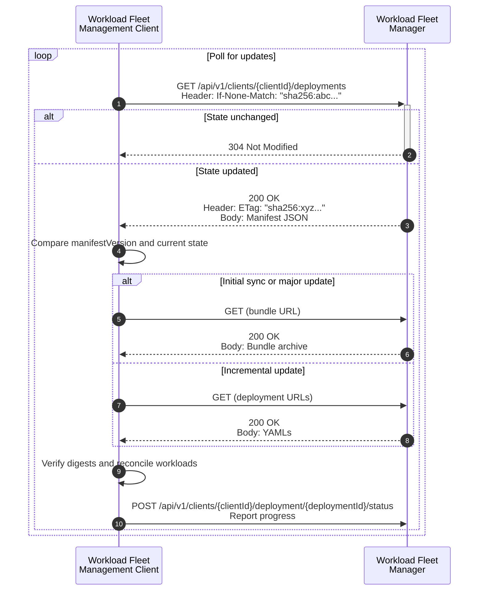

# Desired State

In order for the Workload Fleet Manager (WFM) to manage workloads on an Edge Compute Device, the device's Workload Fleet Management Client must periodically retrieve its desired workload configuration - referred to as the Desired State - from the WFM.

The Desired State defines *what* workloads (applications) should run on the device and *how* they should be configured.
It is distributed using a lightweight, pull-based HTTP API that allows devices to stay synchronized with the WFM.

At the center of this process is the State Manifest, a JSON document that lists all workloads assigned to the device. Each workload is represented by an [`ApplicationDeployment`](#applicationdeployment-yaml-definition) YAML - a self-contained object defining configuration, components, and parameters for that workload.

The manifest includes two complementary ways for the client to obtain the same `ApplicationDeployment` YAMLs:

- Individual YAMLs - each `ApplicationDeployment` YAML fetched separately using its own URL.
- A bundle archive - a single compressed archive containing multiple `ApplicationDeployment` YAMLs.

Both references describe the same content. The bundle is simply a packaging optimization.
This design allows the Workload Fleet Management Client to choose the optimal retrieval strategy depending on network conditions or update size.

| Retrieval Method | Typical Use | Advantages |
| ---------------- | ----------- | ---------- |
| Bundle | Initial onboarding, large updates, high-latency or high-round-trip networks | Single request with minimal overhead |
| Individual YAMLs | Incremental updates, bandwidth-limited or metered links | Only changed workloads are downloaded |

The Workload Fleet Management Client compares the manifest with its current state and reconciles any differences by deploying, updating, or removing workloads.
For every change in deployment state - including installation, updates, removals, and failures - the client MUST report the corresponding status to the WFM using the [Deployment Status API](../../specification/margo-management-interface/deployment-status.md).

## Endpoints - State Manifest

This section defines the API endpoint used by a client to retrieve the State Manifest from the Workload Fleet Manager, representing the complete desired workload configuration assigned to the device.

### Route and HTTP Methods

```https
GET /api/v1/clients/{clientId}/deployments
```

### Route Parameters

| Parameter | Type | Required? | Description |
| --------- | ---- | --------- | ----------- |
| `{clientId}` | string | Y | The unique identifier of the (device) client registered with the WFM during onboarding. |

### Request Headers

| Header | Description |
| ------ | ------------|
| `If-None-Match` *(optional)* | The `ETag` value from the last successfully retrieved manifest. |
| `Accept` *(optional)* | The client SHOULD request the manifest in the `application/vnd.margo.manifest.v1+json` format. If the `Accept` header lists only unsupported types, the server MUST return `406 Not Acceptable`. If omitted, the server MUST return this format by default. |

### Response Codes

| Code | Description |
| ----- | ---------- |
| 200 OK | The response body contains the manifest. The server MUST include a valid `ETag` and `Content-Type: application/vnd.margo.manifest.v1+json`. |
| 304 Not Modified | The response body is empty. Returned if the `If-None-Match` `ETag` matches, i.e. the cached response body has not changed since the last retrieved version. |
| 406 Not Acceptable | The server cannot return a representation matching the `Accept` header. |

### Example State Manifest Response

```json
{
  "manifestVersion": 101,
  "bundle": {
    "mediaType": "application/vnd.margo.bundle.v1+tar+gzip",
    "digest": "sha256:b5c6d7e8f9...",
    "url": "/api/v1/clients/1234/bundles/sha256:b5c6d7e8f9..."
  },
  "deployments": [
    {
      "deploymentId": "a3e2f5dc-912e-494f-8395-52cf3769bc06",
      "digest": "sha256:a4e01b2c3d...",
      "url": "/api/v1/clients/1234/deployments/a3e2f5dc-912e-494f-8395-52cf3769bc06/sha256:a4e01b2c3d..."
    }
  ]
}
```

### Response Body Attributes

| Field | Type | Required? | Description |
| ----- | ---- | --------- | ----------- |
| `manifestVersion` | number | Y | Monotonically increasing unsigned 64-bit integer in the inclusive range `[1, 2^64-1]`. Each new manifest for the same (device) client MUST have a strictly greater value than the previous. The first manifest for a given client MUST use the value 1. |
| `bundle` | object | Y | Describes an archive containing all referenced `ApplicationDeployment` YAMLs. If there are zero deployments (i.e., the `deployments` array is empty), this field MUST be present with the value `null`. An empty archive MUST NOT be served. |
| `bundle.mediaType` | string | Y | MUST be `application/vnd.margo.bundle.v1+tar+gzip`, which denotes a gzip-compressed tar archive (commonly delivered as a .tar.gz) whose root contains one or more `ApplicationDeployment` YAML files. Servers MUST set the HTTP `Content-Type` to this media type. The archive MUST contain exactly the set of YAML files referenced by `deployments`. |
| `bundle.digest` | string | Y | Digest of the bundle archive. MUST equal the digest computed over the exact sequence of bytes in the [bundle endpoint's](#endpoints-deployment-bundle) HTTP `200 OK` response body. See [Protocol - Digest](#protocol-digest) for further details. |
| `bundle.sizeBytes` | number | N | Optional unsigned 64-bit advisory estimate of the decoded payload length in bytes for the bundle archive. Provided for bandwidth estimation and update planning. MUST NOT be used for integrity verification. |
| `bundle.url` | string | Y | Content-addressable retrieval endpoint for the bundle of the form `/api/v1/clients/{clientId}/bundles/{digest}` where `{digest}` equals `bundle.digest`. |
| `deployments` | array | Y | List of deployment objects describing each workload. |
| `deployments[].deploymentId` | string | Y | The UUID of the deployment. MUST equal [`metadata.annotations.id`](#annotations-attributes) in the `ApplicationDeployment`. |
| `deployments[].digest` | string | Y | Digest of the corresponding `ApplicationDeployment` YAML file. MUST equal the digest computed over the exact sequence of bytes in the [individual deployment endpoint's](#endpoints-individual-deployment-yaml) HTTP `200 OK` response body. See [Protocol - Digest](#protocol-digest) for further details. |
| `deployments[].sizeBytes` | number | N | Optional unsigned 64-bit advisory estimate of the decoded payload length in bytes for the `ApplicationDeployment` YAML. Provided for bandwidth estimation and update planning. MUST NOT be used for integrity verification. |
| `deployments[].url` | string | Y | Content-addressable retrieval endpoint for the `ApplicationDeployment` YAML of the form `/api/v1/clients/{clientId}/deployments/{deploymentId}/{digest}` where `{digest}` equals `deployments[].digest`. |

> **Note:** The `ETag` returned from this endpoint is a digest of the entire JSON response body (after serialization). It is independent of `bundle.digest` and individual deployment digests (`deployments[].digest`). See [ETag and Caching](#protocol-etag-and-caching) for details.

### Client Validation Rules

- The client MUST verify the digest of every fetched artifact before use.
- If any digest validation fails, the client MUST abort the update and retain the previous state.
- The client MUST persist both the last accepted `manifestVersion` and `ETag` to prevent rollback across restarts.

## Endpoints - Individual Deployment YAML

This section defines the API endpoint used by a client to retrieve a single `ApplicationDeployment` YAML for incremental synchronization and targeted updates.

### Route and HTTP Methods

```https
GET /api/v1/clients/{clientId}/deployments/{deploymentId}/{digest}
```

### Route Parameters

| Parameter | Type | Required? | Description |
| --------- | ---- | --------- | ----------- |
| `{clientId}` | string | Y | The unique identifier of the (device) client registered with the WFM during onboarding. |
| `{deploymentId}` | string | Y | The UUID of the served `ApplicationDeployment` YAML. This MUST equal to `metadata.annotations.id`. |
| `{digest}` | string | Y | Content-addressable digest of the served `ApplicationDeployment` YAML. See [Protocol - Digest](#protocol-digest) for further details. |

### Response Codes

| Code | Description |
| ---- | ----------- |
| 200 OK | The response body contains the raw `ApplicationDeployment` YAML (`Content-Type: application/yaml`). Server MUST set `ETag` to the quoted digest and SHOULD return `Cache-Control: public, max-age=31536000, immutable`. |
| 404 Not Found | The referenced digest does not exist on the server. `404 Not Found` indicates only that this specific digest is unavailable. It MUST NOT be interpreted as a deletion signal by a client; deletion of workloads is determined solely by absence from the state manifest. |

> **Note:** Servers MAY apply HTTP `Content-Encoding` (e.g., gzip, br). The client advertises support via `Accept-Encoding`. Digests and ETags always refer to the decoded representation (i.e., the exact bytes of the response body after decompressing any HTTP `Content-Encoding` such as gzip). Servers SHOULD include `Vary: Accept-Encoding` if compression is used.

## Endpoints - Deployment Bundle

This section defines the API endpoint used by a client to retrieve a compressed bundle containing all `ApplicationDeployment` YAMLs for efficient bulk synchronization.

### Route and HTTP Methods

```https
GET /api/v1/clients/{clientId}/bundles/{digest}
```

### Route Parameters

| Parameter | Type | Required? | Description |
| --------- | ---- | --------- | ----------- |
| `{clientId}` | string | Y | The unique identifier of the (device) client registered with the WFM during onboarding. |
| `{digest}` | string | Y | Content-addressable digest of the served bundle archive. See [Protocol - Digest](#protocol-digest) for further details. |

### Response Codes

| Code | Description |
| ---- | ----------- |
| 200 OK | The bundle was successfully retrieved. The server MUST set `Content-Type` to the manifest-declared `bundle.mediaType`, `ETag` to the quoted digest, and SHOULD return `Cache-Control: public, max-age=31536000, immutable`. |
| 404 Not Found | The referenced digest does not exist on the server. `404 Not Found` indicates only that this specific digest is unavailable. It MUST NOT be interpreted as a deletion signal by a client; deletion of workloads is determined solely by absence from the state manifest. |

> **Note:** Servers MAY apply `Content-Encoding` (e.g., gzip, br) and SHOULD include `Vary: Accept-Encoding` if they do.

## Protocol - Digest

All Desired State artifacts - including the manifest, bundle archives, and individual `ApplicationDeployment` YAMLs - use a canonical digest to ensure content integrity and consistency across client and server implementations.

A digest has the form `algorithm:encoded`, where both parts are lowercase. Clients and servers MUST NOT add prefixes, suffixes, or whitespace. The required algorithm is `sha256`, and the encoded portion is a 64-character lowercase hexadecimal string.

- The digest MUST be computed over the exact bytes of the decoded HTTP response body - that is, after decompressing any HTTP `Content-Encoding` (for example, gzip or br).
- No reformatting, re-serialization, or newline normalization is permitted during digest computation.

The resulting digest value is used consistently across all API representations:

- In JSON responses: `"digest": "sha256:a4e01b2c3d..."`
- In URLs: `/api/v1/clients/{clientId}/deployments/{deploymentId}/sha256:a4e01b2c3d...`
- In HTTP headers: `ETag: "sha256:a4e01b2c3d..."`

Clients MUST verify that the digest they compute for every retrieved artifact matches the value provided in the manifest. Any mismatch MUST cause the client to abort the update and preserve the previous state.
If a manifest references a digest using an unsupported algorithm, the client MUST treat the manifest as invalid and abort processing.

**Example:**

```text
sha256:a1b2c3d4e5f67890123456789abcdef0123456789abcdef0123456789abcdef
```

> **Note:**
> This API defines the digest format `sha256:<hex>` (lowercase) for JSON fields, URLs, and ETags.
> This digest represents content identity, ensuring that each artifact (manifest, bundle, or `ApplicationDeployment` YAML) can be uniquely verified and referenced within the Desired State API.
>
> By contrast, the mechanism described in the [API Requirements and Security Details](../../specification/margo-management-interface/api-requirements-and-security.md) document - which follows [RFC 9421](https://datatracker.ietf.org/doc/html/rfc9421) - provides HTTP message-level integrity through signed payloads.
> While both rely on the SHA-256 algorithm, they operate at different layers of the protocol:
>
> - The digest in this API defines immutable content identity for artifacts.
> - The RFC 9421 mechanism ensures end-to-end message integrity and authenticity during HTTP transport.

## Protocol - ETag and Caching

All Desired State endpoints implement standard HTTP caching semantics to optimize synchronization between the Workload Fleet Manager (WFM) and the Workload Fleet Management Client. ETags are used to detect content changes and avoid redundant data transfers. Two caching models are defined: one for the mutable State Manifest, and one for immutable, content-addressable resources such as individual deployments and bundles.

### State Manifest Endpoint

For the [State Manifest](#endpoints-state-manifest) endpoint, servers use strong ETags as defined in [RFC 9110 § 8.8.3](https://datatracker.ietf.org/doc/html/rfc9110#section-8.8.3).

- The `ETag` MUST be a strong validator computed as a digest of the exact serialized JSON response body.
  The format MUST follow the digest grammar defined in [Protocol – Digest](#protocol-digest):
  `"<algorithm>:<hex-encoded-hash>"`, for example:
  `"sha256:a4e01b2c3d..."`.
- Servers SHOULD serialize JSON deterministically (for example, per [RFC 8785](https://datatracker.ietf.org/doc/html/rfc8785)) so that logically identical manifests yield identical bytes and therefore identical ETags.
- Manifest responses MUST NOT be marked immutable (e.g., by applying `Cache-Control: immutable` or excessively long `max-age` values). Freshness is controlled through periodic polling using `If-None-Match` revalidation requests.
- When a client presents an `ETag` that matches the current manifest, the server MUST respond with `304 Not Modified`, omitting the response body.

### Content-Addressable Endpoints

For [Individual Deployment YAML](#endpoints-individual-deployment-yaml) and [Deployment Bundle](#endpoints-deployment-bundle) endpoints, the resources are immutable and uniquely identified by their digest.

- The `ETag` MUST equal the quoted digest embedded in the resource’s URL (e.g., `ETag: "sha256:a4e01b2c3d..."`).
  This constitutes a strong validator per [RFC 9110 § 8.8.3](https://datatracker.ietf.org/doc/html/rfc9110#section-8.8.3).
- Servers SHOULD include `Cache-Control: public, max-age=31536000, immutable` to enable long-term caching of immutable artifacts.
- If compression is applied, servers SHOULD include `Vary: Accept-Encoding` to ensure cache correctness across encodings.
- Clients MAY send `If-None-Match` when revalidating cached resources; servers MAY return `304 Not Modified` if the artifact has not changed.

## Deployment Workflow

This section defines the end-to-end workflow followed by a client to retrieve, validate, and reconcile its Desired State with the Workload Fleet Manager.

- The client polls the WFM for the latest manifest using the last known `ETag` (if any):

  ```https
  GET /api/v1/clients/{clientId}/deployments
  ```

  - If the manifest is unchanged, the WFM responds with `304 Not Modified`.
  - If the manifest has changed (`200 OK`), the client:
    - Verifies the `manifestVersion` is strictly greater than the stored version. If not, the update MUST be rejected and SHOULD be logged as a security event. The specific requirements for logging security events are not currently defined and will be addressed in a future version of the specification.
    - Parses the manifest and decides whether to fetch the bundle or individual deployments.
    - Downloads and verifies digests for all referenced `ApplicationDeployment` YAMLs.
  - The client reconciles its local workloads:
    - Adds or updates workloads that appear in the new manifest.
    - Removes workloads no longer present in the new manifest.
  - For each change in workload state, the client reports progress and results to the WFM using the [Deployment Status API](../../specification/margo-management-interface/deployment-status.md).
  - Once reconciliation succeeds, the client MUST durably persist the new `manifestVersion` and associated `ETag` for use in the next poll cycle.

### Sequence Diagram



## ApplicationDeployment YAML Definition

This section defines the structure and YAML schema of an `ApplicationDeployment`, providing a normative reference for Desired State configuration objects.

Each workload is represented as an `ApplicationDeployment` YAML file that specifies its components, configuration, and parameters. This resource is delivered via the Desired State API and referenced by `id` in the Deployment Status API.

```yaml
apiVersion: application.margo.org/v1alpha1
kind: ApplicationDeployment
metadata:
  annotations:
    id: 
    applicationId: 
  name: 
  namespace: 
spec:
    deploymentProfile:
        type: 
        components:
            - name: 
              properties:
    parameters:
        param:
            value: 
            targets:
                - pointer: 
                  components:[]
```

| Attribute | Type | Required? | Description |
| --- | --- | --- | --- |
| apiVersion | string |  Y  | Identifier of the version of the API the object definition follows.|
| kind | string |  Y  | Must be `ApplicationDeployment`.|
| metadata | Metadata |  Y  | Metadata element specifying characteristics about the application deployment. See the [Metadata Attributes](#metadata-attributes) section below.|
| spec | Spec |  Y  | Spec element that defines deployment profile and parameters associated with the application deployment. See the [Spec Attributes](#spec-attributes) section below.|


#### Metadata Attributes

| Attribute | Type | Required? | Description |
| --- | --- | --- | --- |
| annotations | Annotations |  Y  | Defines the application ID and unique identifier associated to the deployment specification. Needs to be assigned by the Workload Orchestration Software. See the [Annotation Attributes](#annotations-attributes) section below.|
| name | string |  Y  | When deploying to Kubernetes, the manifests name. The name is chosen by the workload orchestration vendor and is not displayed anywhere.|
| namespace | string |  Y  | When deploying to Kubernetes, the namespace the manifest is added under. The namespace is chosen by the workload orchestration solution vendor.|


#### Annotations Attributes

| Attribute | Type | Required? | Description |
| --- | --- | --- | --- |
| applicationId | string |  Y  | An identifier for the application. The id is used to help create unique identifiers where required, such as namespaces. The id must be lower case letters and numbers and MAY contain dashes. Uppercase letters, underscores and periods MUST NOT be used. The id MUST NOT be more than 200 characters. The applicationId MUST match the associated application package Metadata "id" attribute.|
| id | string |  Y  | The unique identifier UUID of the deployment specification. Needs to be assigned by the Workload Orchestration Software.|


#### Spec Attributes

| Attribute | Type | Required? | Description |
| --- | --- | --- | --- |
| deploymentProfile | DeploymentProfile |  Y  | Section that defines deployment details including type and components.|
| parameters | map[string][Parameter] |  Y  | Describes the configured parameters applied via the end-user.|


#### DeploymentProfile Attributes

| Attribute | Type | Required? | Description |
| --- | --- | --- | --- |
| type | string |  Y  | The type of deployment profile (e.g., helm.v3, compose).|
| components | Component |  Y  | Components of the application|


#### ComposeDeploymentProfile Attributes

| Attribute | Type | Required? | Description |
| --- | --- | --- | --- |


#### Component Attributes

| Attribute | Type | Required? | Description |
| --- | --- | --- | --- |
| name | string |  Y  | The name of the component.|
| properties | map[string][string] |  Y  | Properties associated with the component.|


#### ComposeComponent Attributes

| Attribute | Type | Required? | Description |
| --- | --- | --- | --- |


#### Parameter Attributes

| Attribute | Type | Required? | Description |
| --- | --- | --- | --- |
| name | string |  Y  | None|
| value | string |  Y  | The value of the parameter.|
| targets | Target |  Y  | The targets associated with the parameter.|


#### Target Attributes

| Attribute | Type | Required? | Description |
| --- | --- | --- | --- |
| pointer | string |  Y  | The pointer indicating the location of the target.|
| components | string |  Y  | The components associated with the target.|


### Example: Cluster Enabled Application Deployment Specification

```yaml
apiVersion: application.margo.org/v1alpha1
kind: ApplicationDeployment
metadata:
    annotations:
        applicationId: com-northstartida-digitron-orchestrator
        id: a3e2f5dc-912e-494f-8395-52cf3769bc06
    name: com-northstartida-digitron-orchestrator-deployment
    namespace: margo-poc
spec:
    deploymentProfile:
        type: helm.v3
        components:
            - name: database-services
              properties:
                repository: oci://quay.io/charts/realtime-database-services
                revision: 2.3.7
                timeout: 8m30s
                wait: "true"
            - name: digitron-orchestrator
              properties:
                repository: oci://northstarida.azurecr.io/charts/northstarida-digitron-orchestrator
                revision: 1.0.9
                wait: "true"
    parameters:
        adminName:
            value: Some One
            targets:
                - pointer: administrator.name
                  components:
                    - digitron-orchestrator
        adminPrincipalName:
            value: someone@somewhere.com
            targets:
                - pointer: administrator.userPrincipalName
                  components:
                    - digitron-orchestrator
        cpuLimit:
            value: "4"
            targets:
                - pointer: settings.limits.cpu
                  components:
                    - digitron-orchestrator
        idpClientId:
            value: 123-ABC
            targets:
                - pointer: idp.clientId
                  components:
                    - digitron-orchestrator
        idpName:
            value: Azure AD
            targets:
                - pointer: idp.name
                  components:
                    - digitron-orchestrator
        idpProvider:
            value: aad
            targets:
                - pointer: idp.provider
                  components:
                    - digitron-orchestrator
        idpUrl:
            value: https://123-abc.com
            targets:
                - pointer: idp.providerUrl
                  components:
                    - digitron-orchestrator
                - pointer: idp.providerMetadata
                  components:
                    - digitron-orchestrator
        memoryLimit:
            value: "16384"
            targets:
                - pointer: settings.limits.memory
                  components:
                    - digitron-orchestrator
        pollFrequency:
            value: "120"
            targets:
                - pointer: settings.pollFrequency
                  components:
                    - digitron-orchestrator
                    - database-services
        siteId:
            value: SID-123-ABC
            targets:
                - pointer: settings.siteId
                  components:
                    - digitron-orchestrator
                    - database-services
```

### Example: Standalone Device Application Deployment Specification

```yaml
apiVersion: application.margo.org/v1alpha1
kind: ApplicationDeployment
metadata:
    annotations:
        applicationId: com-northstartida-digitron-orchestrator
        id: ad9b614e-8912-45f4-a523-372358765def
    name: com-northstartida-digitron-orchestrator-deployment
    namespace: margo-poc
spec:
    deploymentProfile:
        type: compose
        components:
            - name: digitron-orchestrator-docker
              properties:
                keyLocation: https://northsitarida.com/digitron/docker/public-key.asc
                packageLocation: https://northsitarida.com/digitron/docker/digitron-orchestrator.tar.gz
    parameters:
        adminName:
            value: Some One
            targets:
                - pointer: ENV.ADMIN_NAME
                  components:
                    - digitron-orchestrator-docker
        adminPrincipalName:
            value: someone@somewhere.com
            targets:
                - pointer: ENV.ADMIN_PRINCIPALNAME
                  components:
                    - digitron-orchestrator-docker
        idpClientId:
            value: 123-ABC
            targets:
                - pointer: ENV.IDP_CLIENT_ID
                  components:
                    - digitron-orchestrator-docker
        idpName:
            value: Azure AD
            targets:
                - pointer: ENV.IDP_NAME
                  components:
                    - digitron-orchestrator-docker
        idpProvider:
            value: aad
            targets:
                - pointer: ENV.IDP_PROVIDER
                  components:
                    - digitron-orchestrator-docker
        idpUrl:
            value: https://123-abc.com
            targets:
                - pointer: ENV.IDP_URL
                  components:
                    - digitron-orchestrator-docker
        pollFrequency:
            value: "120"
            targets:
                - pointer: ENV.POLL_FREQUENCY
                  components:
                    - digitron-orchestrator-docker
        siteId:
            value: SID-123-ABC
            targets:
                - pointer: ENV.SITE_ID
                  components:
                    - digitron-orchestrator-docker
```