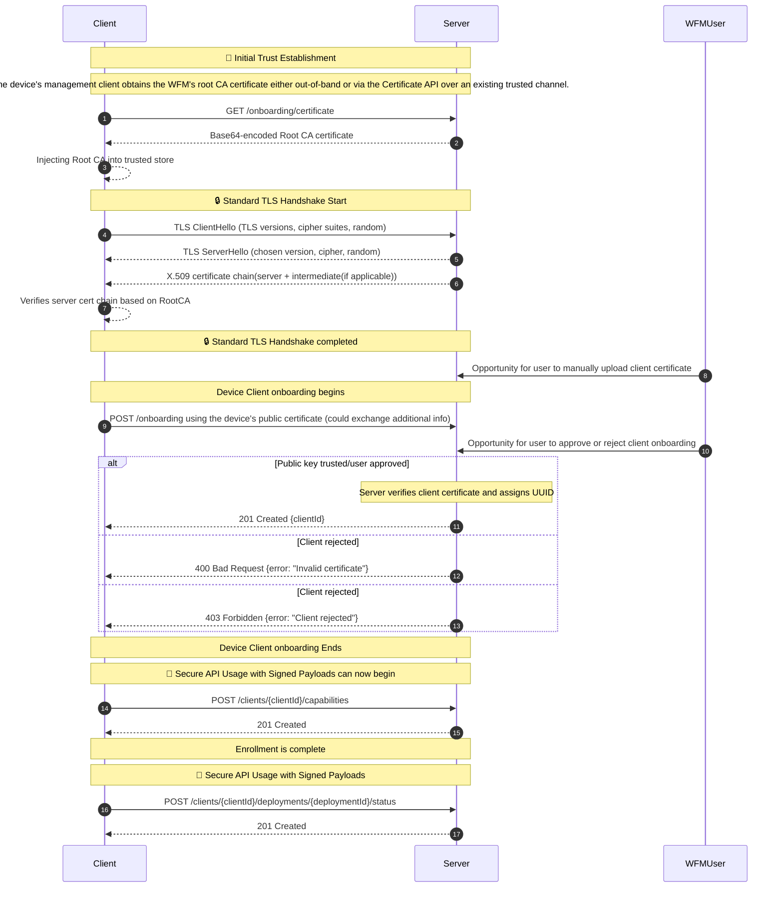

# Device Client Onboarding
In order for the Workload Fleet Management software to manage the edge device's workloads, the device's management client must first complete onboarding.

- Requests to this endpoint MUST be authenticated using the HTTP Message Signature method as defined in the [Payload Security](../margo-management-interface/api-requirements-and-security.md#payload-security-method) section.

## Onboarding Sequence

- The end user provides the the Workload Fleet Management web service's root URL to the device's management client
- The device's management client downloads the Workload Fleet Manager's public root CA certificate using the [Certificate API](../../specification/margo-management-interface/certificate-api.md)
- Context and trust is established between the device's management client and the Workload Fleet Management web service
- The device's management client uses the [Onboarding API](../../specification/margo-management-interface/device-client-onboarding.md) to onboard with the Workload Fleet Management service by providing its X.509 certificate
- The device's management client receives its unique client Id assigned via the Workload Fleet Manager
- The [device capabilities](../../concepts/workload-fleet-managers/device-capabilities.md) information is sent from the device to the WFM using the [Device API](../../specification/margo-management-interface/device-capabilities.md)

## Onboarding Sequence diagram



## Onboarding API Details

## Route and HTTP Methods

```https
POST /api/v1/onboarding
```
## Request Body Attributes

| Fields       | Type            | Required?       | Description     |
|-----------------|-----------------|-----------------|-----------------|
| apiVersion      | string    | Y    | Identifier of the version the API resource follows.|
| kind            | string    | Y    | Must be `OnboardingRequest`.|
| certificate    | string    | Y    | Base64-encoded X.509 certificate of the client. |

### Example Request Body

```json
{ 
  "apiVersion": "onboarding.margo.org/v1alpha1",
  "kind": "OnboardingRequest",
  "certificate": "MIIDdzCCAl+gAwIBAgIEb1...<truncated Base64 X.509 cert>...."
}
```

### Response Codes

| Code | Description |
|------|-------------|
| 201 Created | New client onboarded successfully. |
| 400 Invalid Certificate | Invalid certificate format or structure. |
| 403 Forbidden | Client certificate is not trusted or client rejected. |

## Example Response Body

```json
{
    "clientId": "<base-64 encoded UUID or other URL safe string identifier>"
}
```


