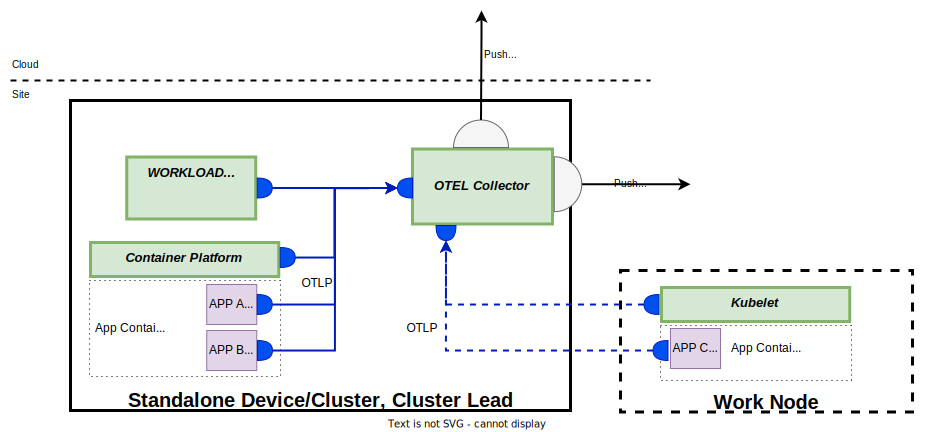
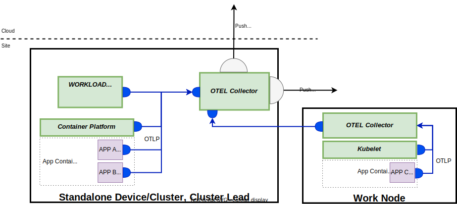

# Observability

Observability is about being able to use information outputs from a system to monitor how the system behaves internally.

Observability data is captured using the following signals:

- [Metrics](https://opentelemetry.io/docs/specs/otel/metrics/) - a numerical measurement in time used to observe change over a period of time or configured limits. For example, memory consumption, CPU Usage, available disk space.
- [Logs](https://opentelemetry.io/docs/specs/otel/logs/) - text outputs produced by a running system/application to provide information about what is happing. For example, outputs to capture security events such as failed login attempts, or unexpected conditions such as errors.  
- [Traces](https://opentelemetry.io/docs/specs/otel/trace/) - contextual data used to follow a request's entire path through a distributed system. For example, trace data can be used to identify bottlenecks, or failure points, within a distributed system.

Margo's application observability scope is limited to the following areas:

- The device's container platform
- The device's workload orchestration agent
- The compliant containerized applications deployed to the device.

The application observability data is intended to be used for the following purposes:

- Monitoring container platform's health and current state. This includes things like memory, cpu and disk usage and availability for clusters, nodes, pods and containers, the current running state for pods and containers, and configured resource limits. This enables a customer to make decision such as whether or not a device can support more applications, or has too many applications deployed.
- Monitoring the workload orchestration agent and containerized application's state to ensure it is running correctly, performing as expected and not consuming more resource than expected.
- To assist with debugging/diagnostics for applications encountering unexpected conditions impacting their ability to run as expected.

Margo's application observability is NOT intended to be used to monitor anything outside the device such as production processes, machinery, controllers, or sensors and should NOT be used for this purpose.

## Observability Framework

Instead of defining our own observability framework we have adopted the [OpenTelemetry specification](https://opentelemetry.io/docs/). OpenTelemetry is a popular open source specification that provides a common way for observability data to be used. There are several reasons why OpenTelemetry was chosen which includes:

- OpenTelemetry is based on a open source specification and not only an implementation
- OpenTelemetry is widely adopted
- OpenTelemetry has a large, and active, open source community
- OpenTelemetry provides [SDKs](https://opentelemetry.io/docs/languages/) for many popular languages if people wish to use them
- The OpenTelemetry community project has a lot of existing tooling that is useful such as telemetry [receivers](https://github.com/open-telemetry/opentelemetry-collector-contrib/tree/main/receiver) for Kubernetes, Docker and the host system.
- OpenTelemetry is vendor agnostic and there are a lot of popular open source, and for purchase, backend solutions available for consuming and displaying observability data on the market.

> **Decision Needed:** Need to determine which version(s) of the specification are supported

**Open Telemetry Collector Deployment Methods**

The device owner MUST deploy, and configure, an OpenTelemetry collector on their device. The device owner MAY choose the deployment model they wish to follow but MUST use one of the following approaches.

For standalone and clustered devices there MUST be at least one OpenTelemetry collector deployed to collect the observability data required below. The Device owner MAY choose to deploy multiple OpenTelemetry collectors with each collector receiving different parts of the observability data required below as long as all required observability data is collected.

For multi-node capable clusters the device owner MAY chose to use the DaemonSet deployment model to ensure there is an OpenTelemetry collector running on each node.

For multi-node capable clusters the device owner MUST ensure the communication between applications, and collector, from one node to a collector on a different node is secure.
> **Action:** Need to research how this is done so we can provide additional information on what is required.

The device owner MUST NOT use the sidecar deployment model at this time since this requires the pods/containers to have foreknowledge of this deployment model.

> **Action:** Some more research needs to be done here. If there is a way to do this dynamically without requiring the application developer to include special attributes on their pods then it may be allowed.

The device owner MUST NOT pre-configure any exporters that would make any observability data available outside the device/cluster.

The device owner MUST NOT attempt to inject auto-instrumentation (by using the [OpenTelemetry operator](https://github.com/open-telemetry/opentelemetry-operator#opentelemetry-auto-instrumentation-injection) for example) into any compliant applications running on the device that are not owned by the device owner.

## Container Platform Observability Requirements

In order to allow for monitoring the chosen container platform's state the device own MUST ensure the following observability data is being collected and made available for export from the OpenTelemetry collector(s) on the device/cluster

**Kubernetes**

For devices running Kubernetes the following is a minimum list of observability data that MUST be provided. The device owner MAY choose to provide additional observability data if they wish.

Cluster (both single or multiple node) observability data MUST be collected. It is recommended the Device Owner use the [Kubernetes Cluster Receiver](https://opentelemetry.io/docs/kubernetes/collector/components/#kubernetes-cluster-receiver) to collect this information but using this receiver is not required.

If the Device Owner chooses not to use the Kubernetes Cluster Receiver they MUST provide the same output as the Kubernetes Cluster Receiver's default configuration.
> **Action:** Determine how we want to represent this information and what the defaults should be if the current defaults are not right.

Cluster events observability data MUST be collected. It is recommended the Device Owner use either the [Kubernetes Objects Receiver](https://opentelemetry.io/docs/kubernetes/collector/components/#kubernetes-objects-receiver) or [Kubernetes Event Receiver](https://github.com/open-telemetry/opentelemetry-collector-contrib/blob/main/receiver/k8seventsreceiver/README.md) to collect this information but using either of these receivers is not required.

If the Device Owner chooses not to use either the Kubernetes Object Receiver or Kubernetes Event Receiver they MUST provide the same output as these Kubernetes Event Receiver's default configuration.
> **Action:** Need to determine which namespaces should be included. All of them, or just the ones the device owner is responsible for creating.
>
> **Action:** Determine how we want to represent this information and what the defaults should be if the current defaults are not right.

Node, Pod and Container observability data MUST be collected. It is recommended the Device Owner use the [Kubelet Stats Receiver](https://opentelemetry.io/docs/kubernetes/collector/components/#kubeletstats-receiver) to collect this information but using this receiver is not required.

If the Device Owner chooses not to use the Kubelet Stats Receiver they MUST provide the same output as the Kubelet Stats Receiver's default configuration.
> **Action:** Determine how we want to represent this information and what the defaults should be if the current defaults are not right.

Metadata identifying the observability data's source MUST be added to the received observability data. It is recommend the Device Owner use the [Kubernetes Attributes Processor](https://opentelemetry.io/docs/kubernetes/collector/components/#kubernetes-attributes-processor) to enhance the observability data with this additional metadata but using this processor is not required.

If the Device Owner chooses not to use the Kubernetes Attributes Processor they MUST provide the same metadata as the Kubernetes Attributes Processor's default configuration
> **Action:** Determine how we want to represent this information and what the defaults should be if the current defaults are not right.

**Non-Clustered Container Platforms (e.g. Docker, Podman)**

> **Action:** We need a better way of referring to this since we're not supposed to say it's running "Docker".

For devices running non-clustered container platforms such as Docker or Podman the following is a minimum list of observability data that MUST be provided. The device owner MAY choose to provide additional observability data if they wish.

Container observability data MUST be collected. It is recommended the Device Owner use the [Docker Stats Receiver](https://github.com/open-telemetry/opentelemetry-collector-contrib/blob/main/receiver/dockerstatsreceiver/README.md) or [Podman Stats Receiver](https://github.com/open-telemetry/opentelemetry-collector-contrib/blob/main/receiver/podmanreceiver/README.md) to collect this information but using either of these receivers is not required.

If the Device Owner chooses not to use either receiver they MUST provide the same output as the receiver's default configuration.
> **Action:** Determine how we want to represent this information and what the defaults should be if the current defaults are not right.

Host observability data MUST be collected. It is recommended the Device Owner use the [Host Metrics Receiver](https://github.com/open-telemetry/opentelemetry-collector-contrib/blob/main/receiver/hostmetricsreceiver/README.md) to collect this information but using this receiver is not required.

If the Device Owner chooses not to use the Host Metrics Receiver they MUST provided the same output as the Host Metrics Receiver's default configuration.
> **Action:** Determine how we want to represent this information and what the defaults should be if the current defaults are not right.

**General**

The collector MUST receive data using the [OLTP](https://opentelemetry.io/docs/specs/otlp/) format. It is recommended the Device Owner use the [OLTP Receiver](https://github.com/open-telemetry/opentelemetry-collector/blob/main/receiver/otlpreceiver/README.md) to allow applications to send observability data to the collector.

If the Device Owner chooses not to use the OLTP Receiver they MUST provide the same functionality as the OLTP receiver.

> **Action:** We will need to determine if there is additional information the device owner needs to include as attributes for each message to ensure the source can be identified. For example, we may require a device device Id attribute.

Log file observability data MUST be collected. It is recommended the Device Owner use the [File Log Receiver](https://github.com/open-telemetry/opentelemetry-collector-contrib/blob/main/receiver/filelogreceiver/README.md) to receive logs from their chosen container platform and applications sending logs to **stdout**.

If the Device Owner chooses not to use the File Log Receiver they MUST provide the same functionality to receive the container platform and application logs.
> **Action:** Determine how we want to represent this information and what the defaults/minimum set of logs should be.

## Workload Orchestration Agent Observability Requirements

It is recommended the workload orchestration agent be deployed as a containerized application for a number of reasons. If it is deployed this way, the application's resource utilization observability data is capture automatically as part of the container platform observability requirements.

If the device owner chooses not to deploy their workload orchestration agent as a containerized application they MUST ensure the following resource usage observability data is available from the OpenTelemetry collector for their agent.

> **Action:** Need to do research to determine what this minimum set is. Might be able to point to some information above once we identify it, instead of duplicating.

In addition to the resource utilization data the workload orchestration agent MUST also send the following minimum set of application observability data to the open telemetry collector on the device/cluster. The device owner MAY choose to provided additional observability data if they wish.

> **Action:** We need to understand what the WOS/a is going to be doing to determine what this is.

## Compliant Application Observability Requirements

Compliant applications MAY choose to expose application specific observability data by sending their observability data to the Open Telemetry collector on the device/cluster. While this is optional, is it highly recommended in order to support distributed diagnostics.

Application developers choosing to expose application logs for consumption with OpenTelemetry they should either write their logs to **stdout** or send them using OTLP so the receiver on the OpenTelemetry collector can import them.
> **Action:** We need some research here to understand if there are any expectations on log format, if it's best to use stdout, log files, or sending logs directly to the collector. Also, need to explore the option to allow people to use third part log collection agents (e.g., FluentBit) that collect the logs and forward them to the collector.

Application developers SHOULD NOT expect their applications to be auto-instrumented by anything outside for their control (by the [OpenTelemetry operator](https://github.com/open-telemetry/opentelemetry-operator#opentelemetry-auto-instrumentation-injection) for example).

An application developer MAY choose an alternative implementation for their observability data but it MUST be self-contained within the deployment of their application. If this is done, it is NOT recommended application developers publish their observability data outside the device/cluster by using any other means other than the Open Telemetry collector. If the application developer chooses to export data without using the OpenTelemetry collector they MUST NOT do this without the customer's approval.

> **Action:** Need to address in some form legacy applications that are not currently using open telemetry and don't want to migrate their application to use it.

**Connecting to the OpenTelemetry Collector**

In order for an application to publish its observability data to the collector on the device/cluster the device own MUST inject the following environment variables into each container.

|Environment Variable|Description|
|---|---|
|OTEL_EXPORTER_OTLP_PROTOCOL|(Optional) "grpc" if the preferred protocol is gRPC, "http/protobuf" if the preferred protocol is HTTP + protobuf. The default is "http/protobuf" if nothing is provided for this environment variable. If the preferred protocol is "grpc" but no gRPC endpoint is provided the application client connects using "http/protobuf". If the preferred protocol is "grpc" but the application client cannot connect via gRPC, the application client connects via "http/protobuf". |
|GRPC_OTEL_EXPORTER_OTLP_ENDPOINT|(Optional) The URL for the application to use to connect to the OpenTelemetry collector using gRPC.|
|HTTP_OTEL_EXPORTER_OTLP_ENDPOINT|(Required) The URL for the application to use to connect to the OpenTelemetry collector HTTP + protobuf|
|OTEL_EXPORTER_OTLP_CERTIFICATE|(Optional)The PATH for the client certificate (in PEM format) to use for secure connections to the OpenTelemetry Collector. The application must connect using the certificate if it is provided.|
> **Action:** We need to do some additional research to validate the above and see if any other data is needed for things like establishing a secure connection to the collector.

## Exporting Observability Data

Customers MAY export observability data from a device/cluster to collectors, or backends, onsite or in the cloud.

> **Decision Needed:** This depends on the decisions about using OpenTelemetry instead of the management API approach. If OpenTelemetry is chosen then there would be some subset of data that MUST be exported to the workload orchestration service vendor.

In order to export this data the Open Telemetry Collector(s) on the device/cluster MUST have their configuration updated.

> **Future Decision:**
> For MVS1 we have decided the configuration is updated manually. We know this is not ideal because it is error prone and can result in changes being made that should not be made. The current thinking is that the device orchestration agent will be responsible for updating the configuration when the WOS vendor or customer needs to add exports but this is out of scope for MVS1.

OpenTelemetry allows using either a push or pull approach for getting data from a collector. If you are a solution vendor offering work load orchestration or observability services in the cloud it is strongly recommend you NOT require a pull method for collecting observability data because most customers will not allow their devices to be exposed this way because of security concerns.

## Consuming Observability Data

Solution vendors, such as the workload orchestration service vendor, MAY choose to consume observability data exported from customer devices to provide valuable services to the customer.

Customers MAY choose to consume observability data exported from their devices to other OpenTelemetry collectors or backends withing their environment that is not on the device.

Device owners are NOT expected to provide backends for consuming observability data on their devices.
