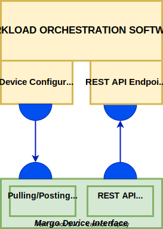

# Workload Orchestration Agent

The Workload Orchestration Agent within Margo represents a service or set of services running on the Edge Device that enables communication in various ways. It enables communication to the Workload Orchestration software to retreive a Desired state, communications with the Margo Device to apply Desired state, and lastly the ability to report to the WOS it's current status and device capability file. These communication patterns are enabled by two main components within the Agent including Pulling/Posting service and Deployment Service. 

The Workload Orchestration Agent can either be pre-packaged by the Device Manufacturer at production or be installed by the Device Integrator. This agent is agnostic to the eventual Workload Orchestration software.  

Margo will maintain within the standard repository reference source code, generic solution, and a test package that can be utilized by Device Owners to build their Orchestration Agent. Device Owners can produce their own agent so long as they follow the minimal requirements outlined below. 

Device Owners must comply with Margo's Workload Orchestration Agent requirements. This can be completed by utilizing Margo's recommended strategies or by utilizng the provided reference implementation out of the box.

Requirements include:

- Support communication pattern that initiates from the device within the safe zone to the Workload Orchestration software.
- Support a pull method that retrieves the Desired State configuration files to be applied. Includes a configurable pulling time interval the user can configure for their use case. Extended disconnection periods must be supported.
- Support a posting method that posts the Current State to the Workload Orchestration Software to ensure it reflects the running state to the user. 
- Enrollment functionality shall occur on the Margo Compliant device with a minimal requirement of configuring a trusted relationship between the Workload Orchestration Software and the Agent.
- The agent must reference industry security standards for port assignments. 
- Communications between the Orchestration Agent and Software must follow secure industry standards.
- It is suggested that the agent shall minimize it's footprint on the Margo compliant device to enable support for wider range of devices. 
- Containerized Workload Orchestration Agents are prefered and enable easier orchestration, however, are not required.

Below is a high-level drawing detailing the communication patterns supported via the Agent.



## Workload Orchestration Agent Enrollment

**Enrollment Process**

In order for the Workload Orchestration Software to manage an Agent, it must first be enrolled. Within Margo, this process is called the Enrollment Process. 

Enrollment process includes:

1. Context and Trust establishment between WOA and the WOS
2. Device Capability information transfer from Device to Orchestration Software

**Enrollment Strategies**

Option 1: Manual configuration of the WOA 
This option describes the steps an End-User will need to accomplish to enroll an Margo Compliant Device manually to the WOS. 

- Retreive Unique Device Identifier
    - This is required to be generated to uniquely identify the Edge Device's WOA. 
- Configure security components to gain access to the Repository

> **Investigation Needed:** Further Investigation needed on this strategy. 

Option 2: Automatically configured during the device's onboarding to the Device Orchestration Software

- This configures the Workload Orchestration Agent to the tenant's corresponding Workload Orchestration Software via information provided in the Device Orchestration software. 
- **Note:** The Device Orchestration Software is not included within MVS1. Enrollment process to be completed by End User. 


**Device Capabilitiy Reporting**

Following the establishment of trust between the WOA and the WOS, the WOA shall post the Margo Device Capabilities file for usage within the orchestrator.

Shall follow the standard format for defining resources at the edge. See [Device Capability Discovery](./device-capability-discovery.md) section for more details.

## Workload Orchestration Software and Agent Communication Patterns

**Application & Configuration Repository Traffic**

**Desired State Configuration Retrieval**

Margo uses a GitOps style approach to manage a node’s applications and associated configuration changes. For each device the Workload Orchestration Software maintains a source code/file-based repository under its control. This code repository shall contain all Desired State changes associated with the particular Device including application lifecycle actions and any associated configurations. The Workload Orchestration Agent is responsible for monitoring this code repository for any changes and applying the Desired State configurations. Additionally, the repository shall be utilized as a location for the WOA to update the WOS of it's Current State. This allows for verification of configuration changes by the Workload Orchestration Software. 

> **Investigation Needed:** Further Investigation needed on this strategy. API vs. OpenGitops Patterns being discussed. 

Workload Orchestration Agent may enable a local caching of the Application Artifacts(manifest/marketplace data/binaries) to enable disconnected states, decrease network traffic, and other benefits.  

It is expected the connection between the Workload Orchestration Agent and the Node Configuration Repository is secured using standard secure connectivity best practices. Some standard practices include the following:

- Basic authentication via HTTPS
- Bearer token authentication
- TLS cert certifications

The following shall be configurable to ensure compliance with local operations. 

- Polling Interval Period - Describes a configurable time period when the Polling is allowed.
- Polling Interval Rate - Describes the rate at which the Agent shall poll the repository for a new Desired State. 
- **Note:** This functionality is expected to be inforced via the Policy Mechanism. See section for further details. 


**Application Deployment Specification**

To ensure interoperability between the Orchestration Software and the Edge device, Margo defines the Application Deployment specification. This deployment specification represents the application desired state the WOS would like the Device to apply and become the current state. 

> **Investigation Needed:** Further Investigation needed on the content regarding deployment for Docker Compose applications. 


**Deployment specification example for Cluster with a single component**
```
apiVersion: margo.org/v1-alpha1
kind: ApplicationDeployment
metadata:
    id: 0f83e682-a35b-4533-ae93-ff3810095f31
    applicationId: com-northstarida-digitron-orchestrator
spec:
    deploymentProfile:
      type: helm.v3
      components:
        - name: digitron-orchestrator
          properties:
            repository: oci://northstarida.azurecr.io/charts/northstarida-digitron-orchestrator
            revision: 1.0.9
    parameters:
      hostname:
        value: edge.host.local
        targets:
          - pointer: edge_host_name
            components: ["digitron-orchestrator"]
          - pointer: global.ingress.host
            components: ["digitron-orchestrator"]
      pollFrequency:
        value: 30
        targets: 
          - pointer: settings.pollFrequency
            components: ["digitron-orchestrator"]
      siteId:
        value: d8b64e67-3bc4-4d0b-a3b8-da94b8f36315
        targets:
          - pointer: settings.siteId
            components: ["digitron-orchestrator"]
```

**Top-level Attributes**

| Attribute       | Type            | Required?       | Description     |
|-----------------|-----------------|-----------------|-----------------|
| apiVersion      | string    | Y    | Identifier of the version of the API the object definition follows.|
| kind            | string    | Y    | Must be `ApplicationDeployment`.|
| metadata        | Metadata    | Y    | Metadata element specifying characteristics about the application deployment. |
| spec            | Spec    | Y    | Spec element that defines deployment profile and parameters associated with the application deployment. |

**Metadata Attributes**

| Attribute        | Type            | Required?       | Description     |
|-----------------|-----------------|-----------------|-----------------|
| id             | string          | Y    | The unique identifier UUID of the deployment specification. Needs to be assigned by the Workload Orchestration Software.|
| applicationId         | string          | Y    | An identifier for the application. The id is used to help create unique identifiers where required, such as namespaces. The id must be lower case letters and numbers and MAY contain dashes. Uppercase letters, underscores and periods MUST NOT be used. The id MUST NOT be more than 200 characters. The applicationId MUST match the associated application package Metadata "id" attribute.|

**Spec Attributes**

| Attribute        | Type            | Required?       | Description     |
|-----------------|-----------------|-----------------|-----------------|
| deploymentProfile           | Deployment Profile          | Y    | Section that defines deployment details including type and components.|
| parameters        | Parameters          | Y    | Describes the configured parameters applied via the end-user.|

**Deployment Profile Attributes**

| Attribute        | Type            | Required?       | Description     |
|------------------|-----------------|-----------------|-----------------|
| type             | string          | Y               | Indicates the components's deployment configuration. The values are `helm.v3` to indicate the component's package format is Helm version 3 and `docker-compose` to indicate the component's package format is Docker Compose. When installing the application on a device supporting the Kubernetes platform all `helm.v3` components, and only `helm.v3` components, will be provided to the device in same order they are listed in the application description file. When installing the application on a device supporting docker-compose all `docker-compose` components, and only `docker-compose` components, will be provided to the device in the same order they are listed in the application description file. The device will install the components in the same order they are listed in the application description file. Component types under `cluster` must use `helm.v3`. Component types under `standalone` must use `docker-compose` |
| components      | []Component    | Y               | Component element indicating the components to deploy when installing the application.|


**Component Attributes**

| Attribute        | Type            | Required?       | Description     |
|------------------|-----------------|-----------------|-----------------|
| name             | string          | Y               | A unique name used to identify the component package. For helm installations the name will be used as the chart name. The name must be lower case letters and numbers and MAY contain dashes. Uppercase letters, underscores and periods MUST NOT be used. |
| properties       | map[string][interface{}] | Y              | A dictionary element specifying the component packages's deployment details. See the [Component Properties](#component-properties) section below.|


**Component Properties**

The expected properties for the suppported deployment types are indicated below.

- Properties for `helm.v3` components

    | Attribute        | Type            | Required?       | Description     |
    |------------------|-----------------|-----------------|-----------------|
    | repository       | string          | Y               | The URL indicating the helm chart's location.|
    | revision         | string          | Y               | The helm chart's full version.|
    | wait             | bool            | N               | If `True`, indicates the device MUST wait until the helm chart has finished installing before installing the next helm chart. The default is `True`. The Workload Orchestration Agent MUST support `True` and MAY support `False`. Only applies if multiple `helm.v3` components are provided.|
    | timeout        | string          | N    | The time to wait for the component's installation to complete. If the installation does not completed before the timeout occurs the installation process fails. The format is "##m##s" indicating the total number of minutes and seconds to wait.|

- Properties for `docker-compose` components

    > **Investigation Needed**: We need to have more discussion about how docker-compose should be handled and what is required here.
    > We also need to determine if there is a version of docker-compose that needs to be specified. The docker compose schema [version has been
    > deprecated](https://github.com/compose-spec/compose-spec/blob/master/spec.md#version-and-name-top-level-elements) so it's not clear what we would even use for this if we wanted to.

    | Attribute        | Type            | Required?       | Description     |
    |------------------|-----------------|-----------------|-----------------|
    | packageLocation  | string          | Y               | The URL indicating the Docker Compose package's location. |
    | keyLocation      | string          | N               | The public key used to validated the digitally signed package. It is highly recommend to digitally sign the package. When signing the package PGP MUST be used.|
    | wait             | bool            | N               | If `True`, indicates the device MUST wait until the Docker Compose file has finished starting up before starting the next Docker Compose file. The default is `True`. The Workload Orchestration Agent MUST support `True` and MAY support `False`. Only applies if multiple `docker-compose` components are provided.|
    | timeout        | string          | N    | The time to wait for the component's installation to complete. If the installation does not completed before the timeout occurs the installation process fails. The format is "##m##s" indicating the total number of minutes and seconds to wait.|

**Parameter Attributes**

| Attribute        | Type            | Required?       | Description     |
|-----------------|-----------------|-----------------|-----------------|
| name           | string          | Y    | Unique name of the parameter.|
| value        | string          | Y    | Value pair matched to the name of the parameter.|
| targets        | Target         | Y    | Describes how the parameter is applied. Noting the Pointer within the application and components it shall be applied to. |


**Target Attributes**

| Attribute        | Type            | Required?       | Description     |
|-----------------|-----------------|-----------------|-----------------|
| pointer           | string          | Y    | Defines the component the previously stated value will be applied to.|
| components        | array         | Y    | Describes which component in the deployment specification the parameter should be applied to.|

**Deployment specification example for Cluster with multiple components**

```
apiVersion: margo.deployment/v1
kind: ApplicationDeployment
metadata:
    id: 0f83e682-a35b-4533-ae93-ff3810095f31
    applicationId: com-northstarida-digitron-orchestrator
spec:
    deploymentProfile:
      type: helm.v3
      components:
        - name: digitron-orchestrator
          properties:
            repository: oci://northstarida.azurecr.io/charts/northstarida-digitron-orchestrator
            revision: 1.0.9
            wait: true
            timeout: 8m0s
        - name: database-services
           properties:
             repository: oci://quay.io/charts/realtime-database-services
             revision: 2.3.7
    parameters:
      hostname:
        value: edge.host.local
        targets:
          - pointer: edge_host_name
            components: ["digitron-orchestrator"]
          - pointer: global.ingress.host
            components: ["digitron-orchestrator", "database-services"]
      pollFrequency:
        value: 30
        targets: 
          - pointer: settings.pollFrequency
            components: ["digitron-orchestrator"]
      siteId:
        value: d8b64e67-3bc4-4d0b-a3b8-da94b8f36315
        targets:
          - pointer: settings.siteId
            components: ["digitron-orchestrator"]
          - pointer: globals.site.id
            components: ["database-services"]
      cpuLimit:
        value: 3
        targets:
          - pointer: settings.limits.cpu
            components: ["digitron-orchestrator"]
      memoryLimit:
        value: 16384
        targets:
          - pointer: settings.limits.memory
            components: ["digitron-orchestrator"]
```


**Deployment specification example for Standalone Device with a single component**

> **Investigation Needed:** Further Investigation needed on the content regarding deployment for Docker Compose applications. 

```
apiVersion: margo.org/v1-alpha1
kind: ApplicationDeployment
metadata:
    id: 0f83e682-a35b-4533-ae93-ff3810095f31
    applicationId: com-northstarida-digitron-orchestrator
spec:
    deploymentProfile:
    type: docker-compose
    components:
      - name: digitron-orchestrator-docker
        properties:
          packageLocation: https://northsitarida.com/digitron/docker/digitron-orchestrator.tar.gz
          keyLocation: https://northsitarida.com/digitron/docker/public-key.asc
    parameters:
      hostname:
        value: edge.host.local
        targets:
          - pointer: edge_host_name
            components: ["digitron-orchestrator-docker"]
          - pointer: global.ingress.host
            components: ["digitron-orchestrator-docker"]

```

**Current State Reporting**

The Workload Orchestration Agent shall update the WOS with the Current State of the Edge Device. This method shall follow the oppposite approach as the Desired State Pulling. The WOA shall post the Current State to the WOS at a user selected interval. This allows the WOS to reconcile the Desired State with the Current State along with updating the user with the GUI. 


**Current State File Format**

> **Investigation Needed:** Further Investigation needed on this topic.


## Workload Orchestration Agent and Device Communication Patterns
The Workload Orchestration Agent will require communication with the Margo Device to apply Desired State configuration files and retrieve Current State information. 

**Applying Desired State Configuration** 
To apply configurations recevied from the WOS, the WOA requires a Deployment Service to first interpret the Desired State configuration and then apply to the local container runtime. 

- Local Approvals shall be supported in this interaction pattern. This ensures the local site is fully responsible for when the Desired State is applied. 
- **Note:** This functionality is expected to be inforced via the Policy Mechanism. See section for further details. 
- Roll backs shall be supported to ensure the operations are not impacted. 


**Artifact Pulling methods**
This interaction pattern defines the mechanism needed to pull additional files down that are associated with the Desired State. 

The Desired state configuration file shall include the meta data required to access the Artifact repository. It is up to the Deployment Service to access the artifact repositories whether local or remote. 
