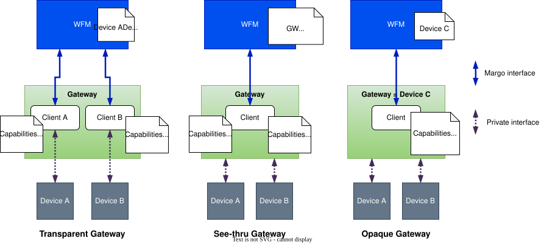

# Gateways

A Margo gateway service is a service that allows one or several non-Margo devices to connect to and be managed by a Margo Workload Fleet Manager (WFM). The gateway service is responsible for translating the communication between the non-Margo devices and the WFM, allowing the non-Margo devices to be managed as Margo devices within the ecosystem.

A Margo gateway service could run on a server, within a device, or on a dedicated device. When running on a dedicated device, it is often referred to as a gateway device. 

Gateways can be divided into 3 types:

* **Transparent gateways** are not visible by the WFM. They provide a Margo client for each downstream device they connect, making them appear as Margo devices to the WFM.
* **See-thru gateways** are visible to the WFM, they act on behalf of one or more downstream devices and each device is visible to the WFM. They host a single Margo client for all the downstream devices they connect and provide the capabilities of each device independently. 
* **Opaque gateways** hide the downstream devices they connect to the WFM, making themselves appear as a single Margo device with the combined capabilities of all the downstream devices they connect.

