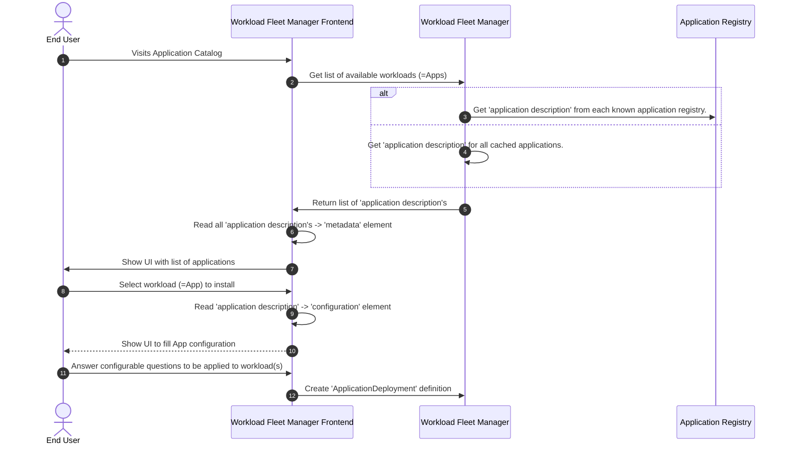

# Application Distribution

To distribute an application it is wrapped as an _application package_ that is provided by an “Application Developer” who aims to provide it to Margo-conformant systems. Therefore, the “Application Developer” creates an **application description**, a YAML document that contains information about the application and a reference on how to deploy the [OCI Containers](https://github.com/opencontainers) that make up the application. The application package is made available in an [application registry](../app-interoperability/workload-orch-to-app-reg-interaction.md) and the OCI artifacts are stored in a remote or [local registry](../app-interoperability/local-registries.md). 

The following diagram shows a possible workflow for the usage of the application description:

1. An end user visits an application catalog (or marketplace) of the Workload Fleet Manager Frontend.
2. This frontend requests all workloads from the Workload Fleet Manager.
3. *Either*: the Workload Fleet Manager requests all application descriptions from each known  Application Registry.
4. *Or*: the Workload Fleet Manager maintains a cache of application descriptions and services the request from there.
5. The Workload Fleet Manager returns the retrieved documents of application descriptions to the frontend.
6. The frontend parses the [metadata](../margo-api-reference/workload-api/application-package-api/application-description.md#metadata-attributes) element of all received application description documents.
7. The frontend presents the parsed metadata in a UI to the end user.
8. The end user selects the workload to be installed.
9. The frontend parses the [configuration](../margo-api-reference/workload-api/application-package-api/application-description.md#configuration-attributes) element of the selected application description.
10. The frontend presents the parsed configuration to the user.
11. The end user fills out the [configurable application parameters](../margo-api-reference/workload-api/application-package-api/application-description.md#defining-configurable-application-parameters) to be applied to the workload.
12. The frontend creates an `ApplicationDeployment` definition (from the `ApplicationDescription` and the filled out parameters) and sends it to the Workload Fleet Manager, which executes it as the [desired state](../margo-api-reference/workload-api/desired-state-api/desired-state.md).

## Relevant Links
Please follow the subsuquent links to view more technical information regarding Margo application packaging:

- [Application Package Definition](../app-interoperability/application-package-definition.md)
- [Application Registry](../app-interoperability/workload-orch-to-app-reg-interaction.md)
