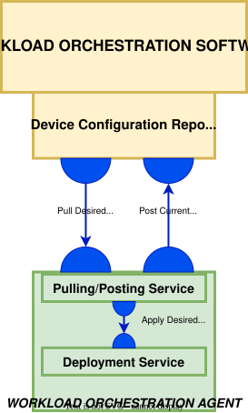
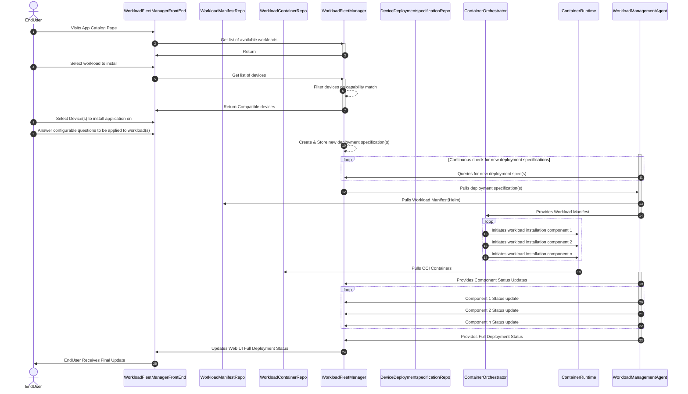

# Workload Management
The [Margo management API](../../margo-api-reference/margo-api-specification.md) is a critical component that enables interoperability between devices and workload orchestration solutions. This API MUST be used for communication between all Margo compliant devices and orchestration services. This documentation section focuses on the workload management functions of this management API. The device's management client implementation can either be pre-packaged by the device manufacturer during production or installed by the device integrator later. 

## Concepts
Below is a list of concepts that Margo management API is governed by. 

State Seeking
The state seeking methodology, adopted via Margo, is enabled first by the Workload Fleet Manager when it establishes the **Desired state**. The Edge Device then reconciles it's **Current state** with the **Desired state** provided by the Fleet Manager and reports the status. 

### Provider Model
The provider model within Margo describes a service that is able to orchestrate or implement the desired state within the edge device. 
Current providers supported:
- Helm Client
- Docker Compose client

## Requirements

- The [Margo management API](../../margo-api-reference/margo-api-specification.md) MUST be used for the following core functions
	- device onboarding with the workload orchestration solution
   	- device capabilities reporting
	- identifying desired state changes
	- deployment status reporting
- The workload orchestration solution vendors MUST implement a web service following the [Margo Management API specification](../../margo-api-reference/margo-api-specification.md).
- The device vendor MUST implement a client following the [Margo Management API specification](../../margo-api-reference/margo-api-specification.md).
- The workload orchestration solution MUST maintain a Git repository to store the devices desired state.
- The device's management client MUST retrieve the device's desired state from the device's assigned Git repository.
- Both Web API and GitOps patterns MUST support extended device communication downtime. 
> Action: The use of GitOps patterns for pulling desired state is still being discussed/investigated. 
- The device's management client MUST reference industry security protocols and port assignments.
- Running the device's management client as containerized services is preferred to enable easier lifecycle management but not required.
- The device's management client MUST allow and end user to configure the following options.
	- Downtime configuration - ensures the device's management client is not retrying communication when operating under a known downtime. Additionally, communication errors MUST be ignored during this configurable period. 
	- Polling Interval Period - describes a configurable time period indicating the hours in which the device's management client checks for updates to the device's desired state.
	- Polling Interval Rate - describes the rate for how frequently the device's management client checks for updates to the device's desire state.

## Workload Deployment Sequence Diagram

## Relevant Links
Please follow the subsuquent links to view more technical information regarding Margo compliant devices:

- [Margo API Reference](../margo-api-reference/margo-api-specification.md)