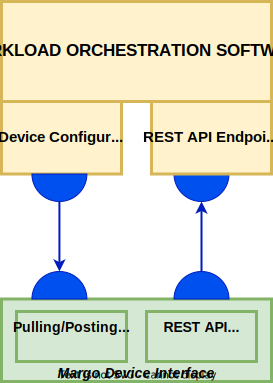

# Margo Management API
The [Margo management API](../../margo-api-reference/margo-api-specification.md) is a critical component that enables interoperability between devices and workload orchestration solutions. This API MUST be used for communication between all Margo compliant devices and orchestration web services. This documentation section focuses on the workload management functions of this management API. The workload management client implementation can either be pre-packaged by the device manufacturer during production or installed by the device integrator later. 

## Workload Management Client Requirements:

- The [Margo management API](../../margo-api-reference/margo-api-specification.md) MUST be used for the following core functions
	- device onboarding with the workload orchestration solution
   	- device capabilities reporting
	- identifying desired state changes
	- deployment status reporting
- The workload orchestration solution vendors MUST implement a web service following the [Margo Management API specification](../../margo-api-reference/margo-api-specification.md).
- The device vendor MUST implement a client following the [Margo Management API specification](../../margo-api-reference/margo-api-specification.md).
- The workload orchestration solution MUST maintain a Git repository to store the devices desired state.
- The management client MUST retrieve the device's desired state from the device's assigned Git repository.
- Both Web API and GitOps patterns MUST support extended device communication downtime. 
- The management client MUST reference industry security protocols and port assignments.
- Running the device management client as containerized services is preferred to enable easier lifecycle management but not required.
- The management client MUST allow and end user to configure the following options.
	- Downtime configuration - ensures the management client is not retrying communication when operating under a known downtime. Additionally, communication errors MUST be ignored during this configurable period. 
	- Polling Interval Period - describes a configurable time period indicating the hours in which the management client checks for updates to the device's desired state.
	- Polling Interval Rate - describes the rate for how frequently the management client checks for updates to the device's desire state.

