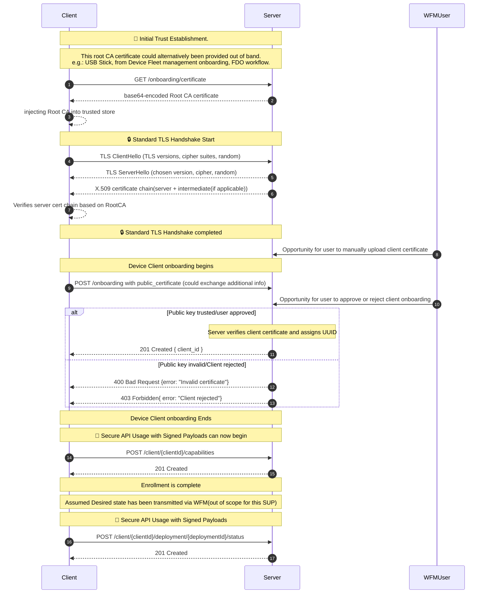

# Device Onboarding
In order for the Workload Fleet Management software to manage the edge device's workloads, the device's management client must first complete onboarding.

## Onboarding API Details

## Route and HTTP Methods

```https
POST /api/v1/onboarding
```
### Response Codes

| Code | Description |
|------|-------------|
| 201 Created | New client onboarded successfully. |
| 400 Invalid Certificate | Invalid certificate format or structure. |
| 403 Forbidden | Client certificate is not trusted or client rejected. |

## Example Response Body

```json
{
    "client_id": "<base-64 encoded UUID>"
}
```

## Onboarding Sequence

- The end user provides the the Workload Fleet Management web service's root URL to the device's management client
- The device's management client downloads the Workload Fleet Manager's public root CA certificate using the [Onboarding API](../../specification/margo-management-interface/certificate-api.md)
- Context and trust is established between the device's management client and the Workload Fleet Management web service
- The device's management client uses the [Onboarding API](../../specification/margo-management-interface/certificate-api.md) to onboard with the Workload Fleet Management service by providing it's x.509 certificate
- The device's management client receives it's unique client Id assigned via the Workload Fleet Manager
- The [device capabilities](../../concepts/workload-fleet-managers/device-capabilities.md) information is sent from the device to the WFM using the [Device API](../../specification/margo-management-interface/device-capabilities.md)

## Onboarding Sequence diagram

