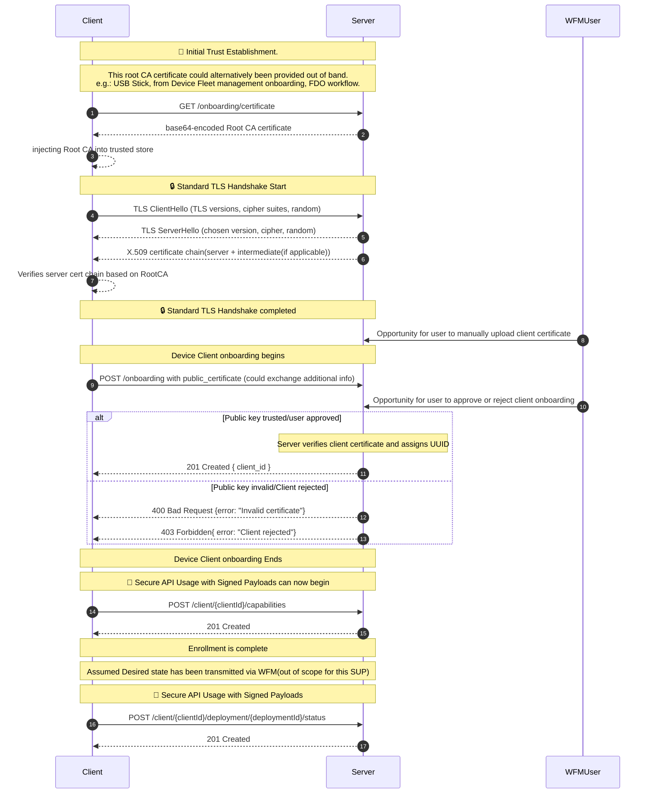

# Device Onboarding
In order for the Workload Fleet Management software to manage the edge device's workloads, the device's management client must first complete onboarding.

> Action: The details in this page are still under discussion and have not been finalized.

**The onboarding process includes:**

- The end user provides the the Workload Fleet Management web service's root URL to the device's management client
- The device's management client downloads the Workload Fleet Manager's public root CA certificate using the [Onboarding API](../../specification/margo-management-interface/certificate-api.md)
- Context and trust is established between the device's management client and the Workload Fleet Management web service
- The device's management client uses the [Onboarding API](../../specification/margo-management-interface/certificate-api.md) to onboard with the Workload Fleet Management service.
- The device's management client receives the client Id, client secret and token endpoint URL used to generate a bearer token.
- The device's management client receives the URL for the Git repository containing its desired state and an associated access token for authentication
> Action: The Margo TWG is currently reviewing alternatives to GitOps. This page will be updated upon a finalization of a new strategy. 
- The [device capabilities](../../concepts/workload-fleet-managers/device-capabilities.md) information is sent from the device to the WFM service using the [Device API](../../specification/margo-management-interface/device-capabilities.md)

## Onboarding Sequence diagram



#### Sequence Diagram Notes
- Following Step 3: Root CA is now trusted in the TLS handshake
- Diagram depicts a standard TLS flow, but additional steps in the handshake can occur.
- (After post /onboarding) 
    - Verification of client cert out of scope of this. Pre specify
    - Step approves the client can join the server. Additional information can be tied to the certificate but are not required in this SUP. supporting information can also be transferred during this step approving this client can join the server. other things could be tied to the certificate. i.e. Cert supplied via Dell / serial number of device /
    - FDO bootstrapping off of ownership vouchers could be integrated here as well. 

## Onboarding API Details
> Action: This API needs to be defined

### Route and HTTP Methods

```http
POST /onboarding/
```
### Request Body

TBD

### Response Body

TBD